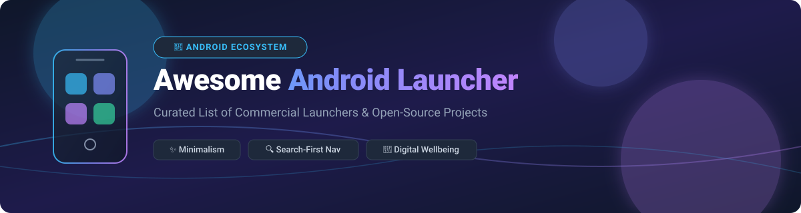

# 🚀 Awesome Android Launcher 📱

  

  
  
  
  
  

> **Curated List of Best Commercial Launchers & Open-Source GitHub Projects for Android Customization, Minimalism, Search-First Navigation & Digital Wellbeing.** 🌿

📅 **Last updated: October 2026**

---

## 📌 Table of Contents 📖

- [✨ Overview](#-overview)
- [💼 Commercial & SaaS Launchers](#-commercial--saas-launchers)
- [🔓 Open-Source GitHub Projects](#-open-source-github-projects)
  - [📱 Pixel-Style & Highly Customizable Launchers](#-pixel-style--highly-customizable-launchers)
  - [🌿 Minimalist & Digital Wellbeing Launchers](#-minimalist--digital-wellbeing-launchers)
- [🛠️ How to Contribute](#️-how-to-contribute)
- [📈 Star History](#-star-history)
- [💖 Support & Sponsorship](#-support--sponsorship)
- [⚠️ Disclaimer](#%EF%B8%8F-disclaimer)

---

## ✨ Overview 🎯

This repository tracks notable **commercial launchers** (SaaS / paid Android customization products) and **open-source projects** for Android home screen replacement. These home screen software tools help users replace their stock launcher with minimal, search-first, or highly customizable alternatives that boost productivity, improve focus, and reduce smartphone screen time.

**Key Categories Covered:**
- 🎨 **Pixel-Style Launchers**: Material You theming, Google feed integration, widget support, and Nova Launcher backup migration.
- ⚡ **Minimalist Launchers**: Text-only interfaces, decluttered home screens, and distraction-free app drawers.
- 🔍 **Search-First Launchers**: Instant fuzzy search across apps, contacts, actions, and web queries.
- 🌱 **Digital Wellbeing Tools**: Intentionally built friction, app limits, and screen time usage trackers to curb digital addiction.

---

## 💼 Commercial & SaaS Launchers 📊

### 📈 Market Size & Industry Dynamics

> **Estimated Market Size**: The global Android launcher, home screen personalization, and digital wellbeing software market is estimated at **~$1.2 Billion - $1.8 Billion**.
>
> **Market Fragmentation**: The market is **highly fragmented**. While ecosystem tech giants (e.g. Microsoft, Xiaomi) capture high volume via OS bundling, independent third-party launchers (Nova, Niagara, Smart Launcher) sustain niche revenue models through freemium upgrades, subscriptions, and one-time Pro licenses. No single commercial provider holds a winner-take-all monopoly.

### 💳 SaaS Product Comparison Table

Below is a detailed breakdown of top commercial Android launchers sorted by **Company Size / Valuation / Revenue** (descending):

| SaaS Product 📱 | Company Size / Valuation / Revenue 🏢 | Specific Pricing 💵 | Free Tier Limit / Free Trial Plan 🎁 | Key Features & Focus 🌟 |
| :--- | :--- | :--- | :--- | :--- |
| **[Microsoft Launcher](https://www.microsoft.com/en-us/launcher)** | **~$3.1 Trillion** (Market Cap) | **Free** ($0.00 / 100% Free) | Unlimited Free (Fully free without ads or paywalls) | Productivity focus, Windows OS integration, glance feed, family safety. |
| **[POCO Launcher](https://www.mi.com/global/poco-launcher/)** | **~$60 Billion** (Xiaomi Market Cap) | **Free** ($0.00 / Free with device/store) | Unlimited Free (No paid upgrade required) | Fast app drawer auto-categorization, clean layout, MIUI/POCO optimization. |
| **[Nova Launcher](https://novalauncher.com/)** | **~$50 Million - $100 Million** (Acquired by Branch Metrics) | **$4.99** (One-time Nova Prime upgrade) | Free tier includes basic grid & dock customization (Ad-supported in 2026; Prime unlocks gesture controls, drawer groups, hide apps) | Long-time standard for Android customization, gesture controls, icon packs. |
| **[Smart Launcher](https://smartlauncher.net/)** | **~$5 Million - $15 Million** (Estimated Revenue/Valuation) | **$2.49/month** or **$16.99/year** or **$39.99** lifetime | Free tier includes automatic app categorization & flower layout (Requires Pro subscription for ambient themes & unlimited pop-up widgets) | Automatic app drawer categorization, responsive flower grid, ultra-fast search. |
| **[Niagara Launcher](https://niagaralauncher.app/)** | **~$2 Million - $5 Million** (Estimated Revenue/Valuation) | **$0.99/month** or **$9.99/year** or **$29.99** lifetime | Free tier includes ad-free clean list layout & basic notification previews (7-day free trial for Niagara Pro unlocks weather, custom fonts & pop-up folders) | Minimalist one-handed list-based navigation, ergonomic alphabet wave scrubber. |
| **[Action Launcher](https://actionlauncher.com/)** | **~$1 Million - $3 Million** (Estimated Revenue/Valuation) | **$4.99** (One-time Action Launcher Plus) | Free tier includes basic home screen grid (Plus license unlocks Quicktheme, Shutters, Quickcovers, and full icon pack support) | QuickCovers for app folders, Shutters for instant widget peek without clutter. |
| **[AIO Launcher](https://aiolauncher.com/)** | **~$500K - $1.5 Million** (Estimated Revenue/Valuation) | **$3.99** (One-time Full Version unlock) | Free tier displays basic information widgets (Full version purchase unlocks custom scripts, Telegram integration, and advanced weather controls) | Information-dense home screen surfacing system metrics, news, and search at a glance. |
| **[Hyperion Launcher](https://hyperionlauncher.dev/)** | **~$300K - $1 Million** (Estimated Revenue/Valuation) | **$2.99** (Hyperion Supreme unlock) | Free tier includes basic launcher settings (Supreme key unlocks custom gesture actions, font changes, and dock animations) | Modern launcher emphasizing performance, fluid animations, and custom styling. |
| **[Apex Launcher](https://apexlauncher.com/)** | **~$300K - $800K** (Estimated Revenue/Valuation) | **$3.99** (Apex Pro key) | Free tier includes standard app drawer & home screen (Pro version unlocks drawer count effects, 9 gesture actions, and folder batching) | Classic Android customizer with grid controls and legacy theme engine support. |

---

## 🔓 Open-Source GitHub Projects 🐙

The open-source Android launcher ecosystem provides privacy-first, ad-free, and customizable home screen alternatives. Open-source repositories below are sorted by **GitHub Star Count** (descending).

### 📱 Pixel-Style & Highly Customizable Launchers

| Repository 📦 | Star Count ⭐ | License 📜 | Highlights & Features ⚡ |
| :--- | :--- | :--- | :--- |
| **[Lawnchair](https://github.com/LawnchairLauncher/lawnchair)** |  | Apache-2.0 | **Leading Pixel Launcher alternative.** Built on AOSP Launcher3 with Material You dynamic color theming, At a Glance widget (Smartspacer integration), Nova Launcher backup import, app drawer folders, and QuickSwitch recents integration. |
| **[Neo Launcher](https://github.com/NeoApplications/Neo-Launcher)** |  | GPL-3.0 | Modern FOSS launcher built on Launcher3 with high customizability, icon pack blending, notification badges, gesture support, and privacy guard features. |
| **[Victoria Launcher](https://github.com/adelmonte/victoria-launcher)** |  | GPL-3.0 | **Open-source Niagara Launcher alternative.** Minimal list-based home screen, side edge A-Z alphabet scrubber, custom `.ttf`/`.otf` font loading, monochrome themed icons, and work profile support with zero network access. |

### 🌿 Minimalist & Digital Wellbeing Launchers

| Repository 📦 | Star Count ⭐ | License 📜 | Highlights & Features ⚡ |
| :--- | :--- | :--- | :--- |
| **[KISS Launcher](https://github.com/Neamar/KISS)** |  | MIT | **Search-first minimal launcher.** Type 1–2 letters to query apps, contacts, device settings, and web searches instantly. Extremely low memory footprint and near-zero battery usage. |
| **[Olauncher](https://github.com/tanujnotes/Olauncher)** |  | GPL-3.0 | **Text-only minimalist launcher.** Clean text home screen showing clock, date, and 4–8 favorite text app shortcuts. Swipe up for quick text search drawer and app hiding options to reduce screen addiction. |
| **[OpenLauncher](https://github.com/OpenLauncherTeam/openlauncher)** |  | BSD-3-Clause | Classic open-source launcher customizable grid replacement with desktop pages, app drawer customization, icon packs, and lightweight layout options. |
| **[Discreet Launcher](https://github.com/Vincent-Falzon/DiscreetLauncher)** |  | GPL-3.0 | **Distraction-free FOSS launcher.** Blank minimalist home screen to highlight wallpapers, gesture-based app drawer access (swipe up/down), folder organization, and zero telemetry. |
| **[Slate](https://github.com/braniik/slate)** |  | GPL-3.0 | **Blank canvas freescreen launcher.** Allows absolute coordinate placement of icons, custom icon rotation (-360° to 360°), multiple icon shapes (squircle, hexagon), and complete control over layout aesthetics. |
| **[Escape Launcher](https://github.com/bostrot/escape-launcher)** |  | GPL-3.0 | **Digital wellbeing focused launcher.** Minimal text UI featuring daily screen time counters, per-app breakdown, and a configurable 5-second delay screen to break compulsive app usage habits. |

---

## 🛠️ How to Contribute 🤝

Contributions are welcome! If you know of an awesome commercial launcher or open-source launcher project on GitHub that should be included:

1. Fork this repository.
2. Add your entry to `README.md` in the appropriate category table.
3. Ensure accurate details: name, website/repo link, star badge, pricing model, license, and factual 1–2 sentence description.
4. Submit a Pull Request (PR) with a clear title and description.

---

## 📈 Star History 📊

---

## 💖 Support & Sponsorship ☕

Thank you for visiting and using **Awesome-Android-Launcher**! 🌟 

If this curated list has helped you discover your ideal Android home screen launcher, minimalist setup, or open-source Android customization tool, please consider supporting the project:

- ⭐ **Star** this repository to help others discover it on GitHub.
- 🔀 **Fork** and share this repo with fellow Android enthusiasts and digital minimalists.
- ☕ **Buy me a coffee**: You can support my open-source maintenance work via the [GitHub Sponsors Dashboard](https://github.com/sponsors/ishandutta2007).

Your support keeps this list updated and maintained for the community! ❤️

---

## ⚠️ Disclaimer 📝

- This is a community-curated list intended for educational and discovery purposes only.
- Installing third-party Android launchers changes system home screen behavior and may require specific permissions (e.g. accessibility, usage access). Always inspect app privacy policies before installation.
- All product names, logos, and brands are property of their respective owners.

---

  <b>Made with ❤️ for Android Users, Digital Minimalists &amp; Open-Source Enthusiasts.</b>

